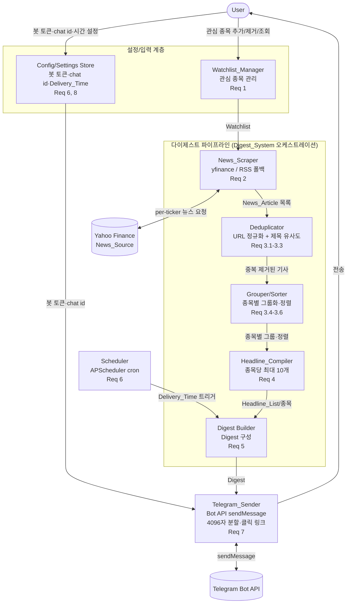

# Design Document

## Overview

이 문서는 `stock-news-telegram-digest` 기능의 기술 설계를 정의한다. 이 시스템은 사용자가 지정한 미국 상장 주식(관심 종목)의 뉴스를 Yahoo Finance에서 매일 자동으로 수집하고, 중복을 제거한 뒤 종목별 헤드라인 목록으로 정리하여, 사용자가 지정한 시간에 텔레그램으로 전송하는 개인용 도구다.

핵심 설계 원칙은 다음과 같다.

- **단순 헤드라인 집계(Simple Headline Aggregation)**: LLM/AI 요약을 사용하지 않는다. 다이제스트는 종목별로 정리된 헤드라인 목록(제목·클릭 가능한 링크·출처·발행 시각)의 컴파일 결과물이다. (Introduction, Req 4)
- **경량성**: 개인용 도구이므로 관심 종목·설정은 로컬 파일(JSON 또는 소형 SQLite)에 저장하고, 비밀 값(봇 토큰)은 환경 변수/`.env`로 관리한다. (Req 8)
- **순수 로직과 I/O의 분리**: 중복 제거, 정렬, 헤드라인 컴파일, 다이제스트 구성, 메시지 분할 등은 부수 효과 없는 순수 함수로 구현하여 property-based testing이 가능하도록 한다. 네트워크 I/O(Yahoo Finance, Telegram)는 얇은 어댑터 계층으로 격리한다.

### 확정된 기술 스택

| 관심사 | 선택 | 근거 |
| --- | --- | --- |
| 언어 | Python 3 (3.11+ 권장) | 사용자 확정. `dataclasses`, `zoneinfo`(표준 IANA time zone) 사용 |
| 뉴스 소스 | Yahoo Finance | 미국 상장 주식 뉴스. `yfinance`의 `Ticker.news`를 1차 프로그래매틱 접근 방식으로 사용 |
| 뉴스 소스 폴백 | Yahoo Finance RSS | `https://feeds.finance.yahoo.com/rss/2.0/headline?s=TICKER&region=US&lang=en-US` — `yfinance` 실패 시 폴백. 취약한 HTML 스크래핑은 지양 |
| 전송 | Telegram Bot API `sendMessage` | `python-telegram-bot` 라이브러리 또는 Bot API 직접 HTTPS 호출. 4096자 분할, 클릭 가능한 링크(HTML/MarkdownV2 parse mode) 지원 |
| 스케줄링 | APScheduler (`BlockingScheduler` + cron trigger) | 1차 인프로세스 스케줄러. OS cron은 대안 배포 옵션으로 명시 |
| 지속성 | 로컬 JSON 또는 소형 SQLite | 경량 개인용. 기본 JSON, 규모 확장 시 SQLite |
| 비밀 관리 | 환경 변수 / `.env` | 봇 토큰 등 비밀 값 |
| 문자열 유사도 | `rapidfuzz`(1차) / `difflib`(폴백) | 정규화된 편집 거리 기반 제목 유사도 85% 임계값 (Req 3.2) |
| 재시도 | `tenacity` 또는 자체 소형 유틸 | 스크래퍼/텔레그램/스케줄러 재시도 |
| 테스트 | `pytest` + `hypothesis` | 단위 테스트 + property-based testing |

> **참고:** `yfinance`는 비공식적으로 Yahoo Finance 엔드포인트를 사용하므로 응답 스키마가 변경될 수 있다. 이 리스크를 완화하기 위해 원시 응답을 곧바로 도메인 모델(`NewsArticle`)로 정규화하는 어댑터를 두고, 검증에 실패한 항목은 제외·기록한다(Req 2.3). RSS 폴백은 스키마가 상대적으로 안정적이다.

## Architecture

시스템은 계층형 파이프라인이다. `Scheduler`가 트리거를 걸면 `Digest_System`(오케스트레이터)이 수집 → 중복 제거 → 그룹화/정렬 → 헤드라인 컴파일 → 다이제스트 구성 → 텔레그램 전송의 순서로 파이프라인을 실행한다. `Watchlist_Manager`와 `Config/Settings store`는 파이프라인 전반에 입력을 제공한다.



### 데이터 흐름 요약

1. **트리거**: `Scheduler`가 설정된 시간대 기준 `Delivery_Time`에 파이프라인 실행 잡을 시작한다. 이전 실행이 진행 중이면 건너뛴다. (Req 6.3–6.5)
2. **수집**: `News_Scraper`가 `Watchlist`의 각 종목에 대해 `News_Source`에서 직전 24시간 이내 기사만, 종목당 최대 20건 수집한다. 유효하지 않은 항목은 제외·기록한다. (Req 2)
3. **중복 제거**: `Deduplicator`가 정규화 URL 기준 → 제목 유사도(85%) 기준으로 중복을 제거한다. (Req 3.1–3.3)
4. **그룹화/정렬**: 각 기사를 정확히 하나의 종목 그룹(또는 "기타")에 매핑하고 최신순(동시각은 제목 사전순)으로 정렬한다. (Req 3.4–3.6)
5. **헤드라인 컴파일**: 종목당 상위 10개 헤드라인으로 `Headline_List`를 만든다. 뉴스 없음/컴파일 실패는 안내/대체 처리한다. (Req 4)
6. **다이제스트 구성**: 날짜(YYYY-MM-DD)와 Watchlist 순서대로 종목별 `Headline_List`를 묶어 `Digest`를 만든다. (Req 5)
7. **전송**: `Telegram_Sender`가 클릭 가능한 링크를 포함해 전송하며, 4096자 초과 시 분할한다. 실패 시 재시도한다. (Req 7)

## Components and Interfaces

아래 인터페이스는 타입 힌트가 있는 Python 시그니처로 표현한다. 순수 로직(중복 제거·정렬·컴파일·구성·분할)은 부수 효과가 없도록 설계하여 property-based testing 대상으로 삼는다.

### 1. Watchlist_Manager (Req 1)

**책임**: 관심 종목(`WatchlistEntry`)의 저장·조회·추가·제거 및 종목 식별자 형식/중복/최대 개수 검증.

```python
class TickerValidationError(Exception): ...
class DuplicateTickerError(Exception): ...
class TickerNotFoundError(Exception): ...
class WatchlistFullError(Exception): ...

MAX_WATCHLIST_SIZE = 100          # Req 1.8
TICKER_PATTERN = r"^[A-Z0-9]{1,20}$"  # Req 1.7 (영문 대문자·숫자 1~20자)

@dataclass(frozen=True)
class OperationResult:
    success: bool
    message: str

class WatchlistManager:
    def __init__(self, store: "WatchlistStore") -> None: ...

    def add(self, ticker: str, display_name: str) -> OperationResult:
        """종목 식별자(1~20자, [A-Z0-9])와 표시명(1~100자)을 검증 후 저장.
        형식 오류→거부(Req 1.7), 중복→거부(Req 1.6), 최대 개수 초과→거부(Req 1.8),
        성공 시 성공 메시지 반환(Req 1.1)."""

    def remove(self, ticker: str) -> OperationResult:
        """존재 시 삭제·성공 메시지(Req 1.2), 미존재 시 거부·미존재 메시지, 목록 불변(Req 1.3)."""

    def list_entries(self) -> list["WatchlistEntry"]:
        """등록 순서를 보존한 전체 목록 반환. 비어 있으면 빈 목록(Req 1.4, 1.5)."""

    @staticmethod
    def validate_ticker(ticker: str) -> None:
        """형식 위반 시 TickerValidationError (Req 1.7)."""
```

**정규화 규칙**: 종목 식별자는 저장·비교 시 대문자로 정규화하여 대소문자 차이로 인한 중복을 방지한다(Req 1.6 중복 판정 일관성).

### 2. Config/Settings Store (Req 6, 8)

**책임**: 텔레그램 봇 토큰·수신 대상 식별자(chat id)·`Delivery_Time`·시간대의 저장·검증. 봇 토큰은 환경 변수/`.env`에서 로드한다.

```python
class SettingsValidationError(Exception): ...
class MissingConfigError(Exception): ...

DEFAULT_DELIVERY_TIME = "08:00"   # Req 8.5 (사용자 시간대 기준 08:00:00)

@dataclass(frozen=True)
class Settings:
    bot_token: str                # 1~100자 (Req 8.2)
    chat_id: str                  # 1~100자 (Req 8.2)
    delivery_time: str            # "HH:MM" 24시간 형식 (Req 6.1)
    timezone: str                 # IANA time zone 식별자 (Req 6.1)

class SettingsStore:
    def load(self) -> Settings:
        """저장된 설정 로드. 봇 토큰은 환경 변수 우선."""

    def save(self, bot_token: str, chat_id: str) -> OperationResult:
        """봇 토큰·chat id 검증(비어있지 않음, 1~100자)(Req 8.2).
        위반 시 저장 거부·오류 기록·기존 값 유지(Req 8.3)."""

    def set_schedule(self, delivery_time: str, timezone: str) -> OperationResult:
        """Delivery_Time(HH:MM, 00:00~23:59)·IANA 시간대 검증(Req 6.1).
        위반 시 거부·기존 일정 유지·오류 메시지(Req 6.2)."""

    @staticmethod
    def validate_settings(bot_token: str, chat_id: str) -> None: ...

    @staticmethod
    def validate_schedule(delivery_time: str, timezone: str) -> None:
        """delivery_time이 HH:MM(00:00~23:59)이 아니거나 timezone이 유효한
        IANA 식별자(zoneinfo.available_timezones())에 없으면 SettingsValidationError."""

    @staticmethod
    def require_send_config(settings: Settings) -> None:
        """봇 토큰/chat id 누락 시 MissingConfigError (Req 8.4)."""
```

### 3. News_Scraper (Req 2)

**책임**: `Watchlist`의 각 종목에 대해 `News_Source`(Yahoo Finance)에서 뉴스를 수집하고, 도메인 모델(`NewsArticle`)로 정규화·검증하며, 24시간 필터·종목당 최대 20건 제한·재시도·실패 격리를 적용한다.

```python
PER_TICKER_LIMIT = 20             # Req 2.1
FRESHNESS_MINUTES = 1440          # Req 2.4 (직전 24시간)
SOURCE_TIMEOUT_SECONDS = 30       # Req 2.5
MAX_SOURCE_RETRIES = 3            # Req 2.5
TITLE_MAX_LEN = 300               # Req 2.2

class NewsSource(Protocol):
    def fetch(self, ticker: str, timeout: float) -> list["RawArticle"]:
        """원시 기사 목록을 반환. 타임아웃/오류 시 예외."""

class YFinanceSource:      # 1차: yfinance Ticker.news
    def fetch(self, ticker: str, timeout: float) -> list["RawArticle"]: ...

class YahooRSSSource:      # 폴백: feeds.finance.yahoo.com RSS
    def fetch(self, ticker: str, timeout: float) -> list["RawArticle"]: ...

@dataclass(frozen=True)
class ScrapeResult:
    articles: list["NewsArticle"]                 # 유효·정규화된 기사
    no_news_tickers: list[str]                    # 뉴스 없음 종목 (Req 2.6)
    excluded: list["ExclusionRecord"]             # 제외 사유 기록 (Req 2.3)
    source_failures: list["SourceFailureRecord"]  # 소스 실패 기록 (Req 2.5)

class NewsScraper:
    def __init__(self, primary: NewsSource, fallback: NewsSource | None = None) -> None: ...

    def scrape(self, watchlist: list["WatchlistEntry"], now_utc: datetime) -> ScrapeResult:
        """각 종목에 대해 수집→정규화→검증→24h 필터→종목당 20건 제한.
        소스 실패는 최대 3회 재시도 후 나머지 종목 계속 진행(Req 2.5)."""

    @staticmethod
    def normalize_and_validate(raw: "RawArticle", ticker: str, now_utc: datetime
                               ) -> "NewsArticle | ExclusionRecord":
        """필수 필드(제목·URL·발행시각·출처·종목) 검증 및 정규화.
        누락/무효 시 ExclusionRecord 반환(Req 2.3). 제목 300자 초과 시 무효."""

    @staticmethod
    def is_fresh(published_at: datetime, now_utc: datetime) -> bool:
        """now_utc 기준 직전 1440분 이내이면 True (Req 2.4)."""
```

### 4. Deduplicator (Req 3.1–3.3)

**책임**: 정규화 URL 기준 중복 제거 → 제목 유사도(85%) 기준 중복 제거. 각 단계에서 발행 시각이 가장 이른 기사를 남기고, 동시각이면 정규화 URL 사전순으로 남긴다.

```python
TITLE_SIMILARITY_THRESHOLD = 85.0   # Req 3.2 (0~100 범위)

class Deduplicator:
    def deduplicate(self, articles: list["NewsArticle"]) -> list["NewsArticle"]:
        """1) URL 기준 중복 제거(Req 3.1) → 2) 제목 유사도 기준 중복 제거(Req 3.2).
        tie-break: 최이른 발행시각 우선, 동시각이면 정규화 URL 사전순(Req 3.3)."""

    @staticmethod
    def normalize_url(url: str) -> str:
        """스킴 소문자화, 호스트 소문자화, 쿼리 스트링·프래그먼트 제거,
        말미 슬래시 정규화(Req 3.1)."""

    @staticmethod
    def title_similarity(a: str, b: str) -> float:
        """정규화된 편집 거리 기반 유사도(0~100). rapidfuzz.fuzz.ratio 사용,
        폴백은 difflib.SequenceMatcher (Req 3.2).
        비교 전 제목 정규화(소문자·공백 축약·구두점 제거)."""

    @staticmethod
    def _survivor(a: "NewsArticle", b: "NewsArticle") -> "NewsArticle":
        """두 중복 기사 중 생존자 선택: 이른 발행시각 → 동시각이면 정규화 URL 사전순(Req 3.3)."""
```

**결정성(determinism) 노트**: 유사도 기반 중복 제거는 비교 순서에 따라 결과가 달라질 수 있으므로, 먼저 `(published_at, normalized_url)` 기준으로 안정 정렬한 뒤 앞에서부터 클러스터링하여 결과가 입력 순서와 무관하게 결정적이 되도록 한다(Property 3 참조).

### 5. Grouper / Sorter (Req 3.4–3.6)

**책임**: 중복 제거된 기사를 정확히 하나의 종목 그룹(또는 "기타")에 매핑하고, 그룹 내에서 최신순(동시각은 제목 사전순)으로 정렬한다.

```python
OTHER_GROUP_KEY = "__OTHER__"   # "기타" 그룹 (Req 3.5)

class Grouper:
    def group_and_sort(self, articles: list["NewsArticle"],
                       watchlist: list["WatchlistEntry"]
                       ) -> dict[str, list["NewsArticle"]]:
        """각 기사를 associated ticker로 매핑(Watchlist에 없으면 "기타")하여
        종목별 그룹화(Req 3.4, 3.5). 각 그룹 내 발행시각 내림차순,
        동시각이면 제목 사전순 정렬(Req 3.6). 결과 키 순서는 Watchlist 순서 + "기타"."""

    @staticmethod
    def sort_key(article: "NewsArticle") -> tuple:
        """(-published_at.timestamp(), title) — 최신순, 동시각 제목 사전순(Req 3.6)."""
```

### 6. Headline_Compiler (Req 4)

**책임**: 각 종목 그룹에 대해 종목당 최대 10개 헤드라인으로 `HeadlineList`를 컴파일한다. 뉴스 없음 안내, 컴파일 실패 시 대체 내용을 처리한다.

```python
MAX_HEADLINES_PER_TICKER = 10   # Req 4.1, 4.4
NO_NEWS_MESSAGE = "관련 뉴스 없음"  # Req 4.5

class HeadlineCompiler:
    def compile(self, ticker: str, display_name: str,
                articles: list["NewsArticle"], has_news: bool) -> "HeadlineList":
        """정렬된 상위 10개 헤드라인으로 HeadlineList 구성(Req 4.1–4.4).
        뉴스 없음이면 안내 문구 + 빈 목록(Req 4.5).
        컴파일 실패 시 status=FAILED, 원본 제목·링크(최대 10) 대체 제공,
        원본 데이터 보존(Req 4.6)."""

    @staticmethod
    def to_headline_item(article: "NewsArticle") -> "HeadlineItem":
        """제목·클릭 가능한 링크·출처·발행시각 포함(Req 4.2)."""
```

### 7. Digest Builder (Digest_System) (Req 5)

**책임**: 모든 종목의 `HeadlineList`를 Watchlist 순서대로 묶어 날짜가 포함된 `Digest`를 구성한다. 빈 Watchlist·컴파일 실패 종목을 처리한다.

```python
class DigestBuilder:
    def build(self, target_date: date, watchlist: list["WatchlistEntry"],
              headline_lists: dict[str, "HeadlineList"]) -> "Digest":
        """target_date(YYYY-MM-DD)(Req 5.2)와 Watchlist 순서대로 종목별
        HeadlineList를 포함한 Digest 구성(Req 5.3).
        빈 Watchlist면 안내 문구 Digest(Req 5.4).
        컴파일 안 된 종목은 '이용 불가' 문구 포함, 나머지는 유지(Req 5.5)."""
```

### 8. Telegram_Sender (Req 7, 8.4)

**책임**: `Digest`를 텔레그램 메시지 텍스트로 렌더링하고, 4096자 이하로 분할하여 순서대로 전송한다. 클릭 가능한 링크를 포함하고, 재시도·실패 기록을 처리한다.

```python
TELEGRAM_MAX_LEN = 4096         # Req 7.2
MAX_SEND_RETRIES = 3            # Req 7.3
SEND_RETRY_BACKOFF_SECONDS = 2  # Req 7.3

class TelegramClient(Protocol):
    def send_message(self, chat_id: str, text: str, parse_mode: str) -> None: ...

class TelegramSender:
    def __init__(self, client: TelegramClient, settings: "Settings") -> None: ...

    def send_digest(self, digest: "Digest") -> "SendResult":
        """require_send_config로 봇 토큰/chat id 확인(Req 8.4).
        뉴스 0건이면 '전송할 뉴스 없음' 메시지(Req 7.6).
        렌더→분할→순서 전송. 실패 시 2초 이상 간격 3회 재시도(Req 7.3),
        최종 실패 시 실패 기록(시각·사유·chat id) 남기고 Digest 보존(Req 7.4)."""

    @staticmethod
    def render(digest: "Digest") -> str:
        """Digest를 parse mode(HTML/MarkdownV2) 텍스트로 렌더링.
        각 기사 링크를 클릭 가능한 형태로 포함(Req 7.5)."""

    @staticmethod
    def split_message(text: str, max_len: int = TELEGRAM_MAX_LEN) -> list[str]:
        """text를 각 chunk가 max_len 이하가 되도록 순서 보존 분할(Req 7.2).
        가능하면 줄 경계에서 분할하여 헤드라인이 잘리지 않게 한다."""
```

### 9. Scheduler (Req 6)

**책임**: 설정된 시간대 기준 `Delivery_Time`에 매일 파이프라인 잡을 실행한다. 중복 실행 방지, 실패 재시도를 처리한다. APScheduler `BlockingScheduler` + cron trigger를 사용한다.

```python
JOB_MAX_RETRIES = 3            # Req 6.6
JOB_RETRY_INTERVAL_SECONDS = 60  # Req 6.6

class Scheduler:
    def __init__(self, settings_store: "SettingsStore", pipeline: "DigestPipeline") -> None: ...

    def start(self) -> None:
        """저장된 Delivery_Time·시간대로 cron trigger 등록 후 blocking 실행(Req 6.3, 6.4).
        Delivery_Time 미지정 시 기본 08:00:00(Req 8.5)."""

    def run_job(self) -> None:
        """이전 실행이 진행 중이면 새 실행을 시작하지 않고 건너뜀 기록(Req 6.5).
        파이프라인 실행 실패 시 60초 간격 3회 재시도, 모두 실패 시 실패 기록(Req 6.6).
        max_instances=1, coalesce=True로 오버랩 방지."""
```

### 10. DigestPipeline (Digest_System 오케스트레이터)

**책임**: 순수 로직 컴포넌트와 I/O 어댑터를 조립하여 end-to-end 실행을 조율한다.

```python
class DigestPipeline:
    def run(self, now_utc: datetime, target_date: date) -> "SendResult":
        """scrape → deduplicate → group_and_sort → compile → build → send_digest.
        각 종목 헤드라인 컴파일은 5초 이내(Req 4.1), Digest 구성은 30초 이내(Req 5.1) 목표."""
```

## Data Models

모든 도메인 모델은 `@dataclass`로 정의하며, 불변이 자연스러운 값 객체는 `frozen=True`로 둔다. 시간은 모두 UTC `datetime`(tz-aware)로 저장한다(Req 2.2).

```python
from dataclasses import dataclass, field
from datetime import datetime, date
from enum import Enum

@dataclass(frozen=True)
class WatchlistEntry:
    ticker: str          # 정규화된 대문자, [A-Z0-9]{1,20} (Req 1.1, 1.7)
    display_name: str    # 1~100자 (Req 1.1)

@dataclass(frozen=True)
class NewsArticle:
    title: str           # 최대 300자 (Req 2.2)
    url: str             # 유효한 URL (Req 2.2)
    published_at: datetime  # UTC tz-aware (Req 2.2)
    source: str          # 출처 이름 (Req 2.2)
    ticker: str          # 관련 종목 식별자 (Req 2.2)

@dataclass(frozen=True)
class RawArticle:
    """소스 어댑터가 반환하는 미정규화 원시 항목."""
    title: str | None
    url: str | None
    published_at: datetime | None
    source: str | None

@dataclass(frozen=True)
class ExclusionRecord:
    raw: RawArticle
    ticker: str
    reason: str          # 제외 사유 (Req 2.3)

@dataclass(frozen=True)
class SourceFailureRecord:
    source_name: str
    ticker: str
    reason: str          # 실패 사유 (Req 2.5)
    attempts: int

@dataclass(frozen=True)
class HeadlineItem:
    title: str
    url: str             # 클릭 가능한 원문 링크 (Req 4.2, 7.5)
    source: str
    published_at: datetime

class HeadlineListStatus(Enum):
    OK = "ok"
    NO_NEWS = "no_news"      # Req 4.5
    FAILED = "failed"        # Req 4.6

@dataclass
class HeadlineList:
    ticker: str
    display_name: str
    items: list[HeadlineItem] = field(default_factory=list)  # 최대 10개 (Req 4.1, 4.4)
    status: HeadlineListStatus = HeadlineListStatus.OK
    note: str | None = None  # "관련 뉴스 없음"/실패 안내 (Req 4.5, 4.6)

@dataclass
class Digest:
    target_date: date                        # YYYY-MM-DD로 렌더 (Req 5.2)
    sections: list[HeadlineList] = field(default_factory=list)  # Watchlist 순서 (Req 5.3)
    empty_watchlist_note: str | None = None  # Req 5.4

    @property
    def total_article_count(self) -> int:    # Req 7.6 판정용
        return sum(len(s.items) for s in self.sections)

@dataclass(frozen=True)
class Settings:
    bot_token: str       # 1~100자 (Req 8.2)
    chat_id: str         # 1~100자 (Req 8.2)
    delivery_time: str   # "HH:MM" (Req 6.1, 8.5 기본 "08:00")
    timezone: str        # IANA time zone (Req 6.1)

@dataclass(frozen=True)
class OperationResult:
    success: bool
    message: str

@dataclass
class SendResult:
    sent: bool
    message_count: int
    failure: "SendFailureRecord | None" = None

@dataclass(frozen=True)
class SendFailureRecord:
    failed_at: datetime
    reason: str
    chat_id: str         # Req 7.4
```

**지속성 매핑**: `WatchlistEntry`와 `Settings`(봇 토큰 제외)는 로컬 JSON 파일(예: `watchlist.json`, `settings.json`)에 직렬화한다. 봇 토큰은 환경 변수(`TELEGRAM_BOT_TOKEN`)/`.env`에서 로드하며 파일에 평문 저장하지 않는다(Req 8). 규모가 커지면 동일 스키마를 SQLite 테이블로 이전할 수 있다.


## Correctness Properties

*A property is a characteristic or behavior that should hold true across all valid executions of a system—essentially, a formal statement about what the system should do. Properties serve as the bridge between human-readable specifications and machine-verifiable correctness guarantees.*

아래 프로퍼티들은 위 prework 분석과 property reflection(중복 통합)을 거쳐 도출되었다. 각 프로퍼티는 부수 효과 없는 순수 로직에 대해 `hypothesis`로 최소 100회 반복 검증한다. 성능 요구(Req 4.1의 5초, Req 5.1의 30초), 외부 서비스 상호작용(스크래퍼 재시도, 스케줄러 트리거, 텔레그램 전송)은 프로퍼티가 아닌 통합/스모크 테스트로 다룬다(Testing Strategy 참조).

### Property 1: 관심 종목 추가 후 조회 일관성

*For any* 유효한 `WatchlistEntry` 목록(중복 없는 티커)에 대해, 순차적으로 add하면 `list_entries()`는 삽입 순서를 보존하여 추가된 모든 항목을 정확히 반환하고, 각 add는 목록 크기를 정확히 1 증가시킨다.

**Validates: Requirements 1.1, 1.4**

### Property 2: 추가–제거 round-trip

*For any* watchlist 상태와 그 상태에 없는 유효 티커에 대해, 해당 티커를 add한 뒤 remove하면 watchlist는 add 이전 상태와 완전히 동일하다(round-trip).

**Validates: Requirements 1.1, 1.2**

### Property 3: 미존재 티커 제거의 불변성

*For any* watchlist 상태와 그 상태에 존재하지 않는 티커에 대해, remove 요청은 `success=False`를 반환하고 watchlist는 변경되지 않는다.

**Validates: Requirements 1.3**

### Property 4: 중복 추가 멱등성

*For any* 유효 티커에 대해, 같은 티커(대소문자 정규화 후 동일)를 두 번 add한 결과 상태는 한 번만 add한 상태와 동일하며, 두 번째 add는 `success=False`를 반환한다.

**Validates: Requirements 1.6**

### Property 5: 무효 티커 거부

*For any* 정규식 `^[A-Z0-9]{1,20}$`를 만족하지 않는 문자열(빈 값, 소문자·특수문자 포함, 20자 초과 등)에 대해, add는 거부되고 watchlist는 변경되지 않는다.

**Validates: Requirements 1.7**

### Property 6: 종목당 수집 상한

*For any* 종목과 소스가 반환하는 임의 개수의 원시 기사에 대해, `scrape` 결과에서 해당 종목의 유효 기사 수는 20건 이하이다.

**Validates: Requirements 2.1**

### Property 7: 정규화 결과의 필드 제약

*For any* 유효한 `RawArticle`에 대해, `normalize_and_validate`가 반환하는 `NewsArticle`은 항상 제목 길이 ≤ 300, tz-aware UTC `published_at`, 비어 있지 않은 URL·출처·티커를 갖는다.

**Validates: Requirements 2.2**

### Property 8: 무효 기사 제외

*For any* 제목·URL·발행시각·출처·티커 중 하나 이상이 누락되거나 무효인 `RawArticle`에 대해, 그 기사는 `ScrapeResult.articles`에 포함되지 않고 `excluded`에 사유와 함께 기록된다.

**Validates: Requirements 2.3**

### Property 9: 24시간 신선도 필터

*For any* 임의 발행 시각을 갖는 기사 집합과 기준 시각 `now_utc`에 대해, `scrape` 결과의 모든 기사는 `now_utc` 기준 직전 1440분 이내이며, 그 범위 밖의 기사는 결과에 포함되지 않는다.

**Validates: Requirements 2.4**

### Property 10: 중복 제거 결과에는 중복이 없다

*For any* `NewsArticle` 목록에 대해, `deduplicate` 결과에서는 (a) 어떤 두 기사도 동일한 정규화 URL을 갖지 않으며, (b) 서로 다른 정규화 URL을 갖는 임의의 두 기사의 제목 유사도는 85% 미만이다.

**Validates: Requirements 3.1, 3.2**

### Property 11: 중복 제거 생존자 선택의 결정성

*For any* 중복 기사 클러스터에 대해, `deduplicate`는 발행 시각이 가장 이른 기사를 생존자로 남기고, 발행 시각이 동일하면 정규화 URL의 사전순으로 앞선 기사를 남긴다. 결과는 입력 순서와 무관하게 결정적이다.

**Validates: Requirements 3.1, 3.2, 3.3**

### Property 12: 중복 제거 멱등성

*For any* `NewsArticle` 목록에 대해, `deduplicate`를 한 번 적용한 결과에 다시 `deduplicate`를 적용해도 결과는 변하지 않는다: `dedup(dedup(x)) == dedup(x)`.

**Validates: Requirements 3.1, 3.2**

### Property 13: 그룹화는 완전한 분할이다

*For any* `NewsArticle` 목록과 watchlist에 대해, `group_and_sort`의 모든 그룹에 속한 기사의 총 개수는 입력 기사 개수와 같고, 각 기사는 정확히 하나의 그룹에만 나타난다(중복·누락 없음).

**Validates: Requirements 3.4**

### Property 14: 미일치 기사는 "기타" 그룹으로

*For any* 관련 티커가 watchlist의 어느 항목과도 일치하지 않는 기사에 대해, 그 기사는 `group_and_sort` 결과의 "기타" 그룹(`OTHER_GROUP_KEY`)에 속한다.

**Validates: Requirements 3.5**

### Property 15: 정렬 및 상위 10개 선택 불변식

*For any* 한 종목 그룹의 기사 목록에 대해, `HeadlineCompiler.compile` 결과의 헤드라인은 발행 시각 내림차순(동일 시각은 제목 사전순)으로 정렬되어 있고, 개수는 10개 이하이며, 원본이 10개를 초과하면 결과는 정확히 그 정렬 순서상 상위 10개와 일치한다.

**Validates: Requirements 3.6, 4.1, 4.3, 4.4**

### Property 16: 헤드라인 항목의 필드 완전성

*For any* 유효한 `NewsArticle`에 대해, `to_headline_item` 결과는 제목, 원문 링크(URL), 출처, 발행 시각을 모두 비어 있지 않게 포함한다.

**Validates: Requirements 4.2**

### Property 17: 다이제스트 섹션 순서 보존

*For any* 비어 있지 않은 watchlist와 그에 대응하는 `HeadlineList` 집합에 대해, `DigestBuilder.build` 결과 `Digest.sections`의 종목 순서는 watchlist 등록 순서와 정확히 일치하며, 각 섹션은 해당 종목의 표시명을 포함한다.

**Validates: Requirements 5.3**

### Property 18: 날짜 포맷

*For any* 대상 `date`에 대해, 렌더된 다이제스트 텍스트는 그 날짜를 `YYYY-MM-DD` 형식으로 포함한다.

**Validates: Requirements 5.2**

### Property 19: 메시지 분할 재구성 및 길이 상한

*For any* 문자열 `text`에 대해, `split_message(text)`가 반환하는 모든 조각은 길이가 4096 이하이고, 조각들을 원래 순서대로 이어 붙이면(줄 경계 분할 시 삽입된 개행을 정규화하여) 원본 내용을 복원하며, 조각의 순서는 원본 순서를 보존한다.

**Validates: Requirements 7.2**

### Property 20: 클릭 가능한 링크 포함

*For any* `Digest`에 대해, `TelegramSender.render` 결과 텍스트는 다이제스트에 포함된 각 기사의 원문 URL을 선택된 parse mode에 맞는 클릭 가능한 링크 마크업(HTML `<a href>` 또는 MarkdownV2 `[text](url)`)으로 포함한다.

**Validates: Requirements 7.5**

### Property 21: 설정 저장 round-trip

*For any* 유효한 봇 토큰(1~100자)·chat id(1~100자)·`Delivery_Time`(HH:MM, 00:00~23:59)·IANA 시간대에 대해, `save`/`set_schedule` 후 `load`하면 저장한 값과 동일한 설정을 얻는다.

**Validates: Requirements 6.1, 8.1, 8.2**

### Property 22: 설정 검증 거부와 기존 값 보존

*For any* 무효한 입력(빈 토큰/chat id 또는 길이 범위 위반, 또는 HH:MM 형식이 아닌 시각/무효 IANA 시간대)에 대해, 저장은 거부되고 기존 설정 값은 변경되지 않는다.

**Validates: Requirements 6.2, 8.3**

## Error Handling

오류 처리는 "실패를 격리하고 기록하되 가능한 한 파이프라인을 계속 진행한다"는 원칙을 따른다.

### 뉴스 수집 오류 (Req 2.3, 2.5, 2.6)

- **소스 요청 실패/타임아웃(30초 초과)**: 실패한 `News_Source`와 사유를 `SourceFailureRecord`에 기록하고 최대 3회 재시도한다. 3회 후에도 실패하면 폴백 소스(RSS)를 시도하고, 그래도 실패하면 해당 종목을 건너뛴 뒤 나머지 종목 수집을 계속한다.
- **필드 누락/무효 기사**: `ExclusionRecord`(원본·티커·사유)에 기록하고 결과에서 제외한다. 파이프라인은 중단되지 않는다.
- **종목별 유효 기사 0건**: `no_news_tickers`에 등록하고 count를 0으로 기록한다. (헤드라인 컴파일 단계에서 "관련 뉴스 없음" 처리로 이어진다.)

### 헤드라인 컴파일 오류 (Req 4.5, 4.6)

- **뉴스 없음 종목**: `HeadlineList(status=NO_NEWS, items=[], note="관련 뉴스 없음")`.
- **컴파일 실패**: `HeadlineList(status=FAILED)`로 표시하고 원본 `NewsArticle`의 제목·링크(최대 10개)를 대체 내용으로 채운다. 원본 데이터는 폐기하지 않고 보존한다.

### 다이제스트 구성 오류 (Req 5.4, 5.5)

- **빈 watchlist**: `empty_watchlist_note`를 설정한 안내용 `Digest`를 구성한다.
- **일부 종목 미컴파일**: 해당 종목 섹션에 "헤드라인 목록 이용 불가" 문구를 넣고, 컴파일된 나머지 섹션은 그대로 유지한다.

### 스케줄러 오류 (Req 6.5, 6.6)

- **오버랩(이전 작업 진행 중)**: APScheduler `max_instances=1`, `coalesce=True`로 새 실행을 시작하지 않고 건너뛴 시각을 기록한다.
- **잡 실행 실패**: 60초 간격으로 최대 3회 재시도하고, 모두 실패하면 실패 사실과 시각을 기록한다.

### 텔레그램 전송 오류 (Req 7.3, 7.4)

- **전송 실패**: 각 재시도 사이 최소 2초 대기하며 최대 3회 재시도한다.
- **최종 실패**: `SendFailureRecord`(실패 시각·사유·chat id)를 남기고 실패한 `Digest` 데이터를 보존한다.

### 설정 누락/무효 (Req 8.3, 8.4, 8.6)

- **저장 시 무효 값**: 저장을 거부하고 어떤 항목이 무효인지 오류로 기록하며 기존 값을 유지한다.
- **전송 시점 자격증명 누락**: `require_send_config`가 `MissingConfigError`를 발생시켜 전송을 중단하고, 누락 항목을 기록하며 전송 대상 데이터를 변경하지 않는다.
- **무효 Delivery_Time**: 거부·오류 기록 후 기본값 08:00:00(사용자 시간대)을 사용한다.

## Testing Strategy

**이중 테스트 접근(Dual Testing Approach)**: 순수 로직의 보편 프로퍼티는 property-based test로, 구체 예시·엣지·오류 경로와 외부 상호작용은 unit/integration test로 검증한다. 이 기능은 중복 제거·정렬·컴파일·구성·문자열 분할·검증 등 입력에 따라 동작이 유의미하게 달라지는 순수 로직이 많아 PBT가 적합하다. 반면 Yahoo Finance/Telegram/스케줄러 트리거처럼 외부 서비스에 의존하는 부분은 mock 기반 통합 테스트로 다룬다.

### Property-Based Tests (`hypothesis`)

- 라이브러리: `hypothesis`. property-based testing을 처음부터 구현하지 않는다.
- 각 프로퍼티 테스트는 최소 **100회** 반복(`@settings(max_examples=100)` 이상)한다.
- 각 테스트는 대응하는 설계 프로퍼티를 주석 태그로 참조한다.
- 태그 형식: **Feature: stock-news-telegram-digest, Property {number}: {property_text}**
- 각 Correctness Property는 **하나의** property-based test로 구현한다(Property 1–22).
- 생성기(strategy) 가이드:
  - `WatchlistEntry`: `^[A-Z0-9]{1,20}$` 티커, 1~100자 표시명. 무효 케이스용 별도 전략(빈 값·소문자·특수문자·21자+).
  - `NewsArticle`: 제목(≤300자, 유사 변형 포함), URL(쿼리/프래그먼트 변형으로 정규화 중복 유도), UTC 시각(now 기준 ±offset으로 신선도 경계 커버), 출처, 티커.
  - `Settings`: 유효/무효 토큰·chat id 길이, HH:MM 경계(00:00, 23:59, 24:00, 12:60), IANA/무효 시간대.
  - 텍스트 분할: 임의 길이·개행 포함 문자열로 4096 경계 커버.

### Unit Tests (`pytest`)

구체 예시·엣지·오류 경로를 다룬다(프로퍼티로 커버되지 않는 사례):

- Req 1.5 빈 watchlist 조회 → `[]`
- Req 1.8 100개 상한 도달 시 추가 거부(경계)
- Req 2.6 종목별 0건 → no news 표시
- Req 4.5 뉴스 없음 안내 / Req 4.6 컴파일 실패 대체·원본 보존
- Req 5.4 빈 watchlist 안내 / Req 5.5 부분 컴파일 실패 유지
- Req 7.6 기사 0건 → "전송할 뉴스 없음" 메시지
- Req 8.4 자격증명 누락 시 전송 중단 / Req 8.5 기본 08:00 / Req 8.6 무효 시각 → 기본값

### Integration Tests (mock 기반)

외부 서비스는 mock으로 대체하여 상호작용·재시도·설정 검증을 확인한다:

- Req 2.5 소스 실패 → 3회 재시도 후 나머지 종목 계속(폴백 포함)
- Req 6.3/6.4 cron trigger 등록·다음 실행 시각 / Req 6.5 오버랩 시 건너뜀 / Req 6.6 잡 실패 3회 재시도·기록
- Req 7.1 전송 호출 / Req 7.3 전송 실패 시 2초 간격 3회 재시도 / Req 7.4 최종 실패 기록·Digest 보존
- end-to-end 스모크: mock Yahoo Finance + mock Telegram으로 `DigestPipeline.run` 전 구간 1회 실행(Req 5.1 완주 확인)

### 참고: PBT를 적용하지 않는 부분

- 스케줄러 트리거 정확도(Req 6.3)와 반복 실행(Req 6.4), 전송 재시도 타이밍(Req 7.3), 성능 목표(Req 4.1의 5초·Req 5.1의 30초)는 동작이 입력에 따라 유의미하게 변하지 않거나 외부 시간/서비스에 의존하므로 통합/스모크 테스트로 검증한다.
- `yfinance`/RSS 응답 파싱 자체는 어댑터 단위 테스트(대표 샘플 응답)로 다루되, 정규화 이후의 도메인 로직은 프로퍼티로 검증한다.

## Suggested Project Structure

스펙 문서는 `.kiro/specs/`에 보관하고, 실제 구현 코드는 리포지토리 내 Python 패키지로 배치한다(아래는 권장 레이아웃이며 코드 파일은 이 워크플로에서 생성하지 않는다).

```
repo-root/
├── .kiro/
│   └── specs/
│       └── stock-news-telegram-digest/
│           ├── requirements.md
│           ├── design.md          # 이 문서
│           └── tasks.md           # (다음 단계에서 생성)
├── src/
│   └── stock_digest/
│       ├── __init__.py
│       ├── models.py              # dataclasses (Data Models)
│       ├── watchlist.py           # WatchlistManager + WatchlistStore
│       ├── settings.py            # SettingsStore, Settings
│       ├── sources/
│       │   ├── __init__.py
│       │   ├── base.py            # NewsSource Protocol, RawArticle
│       │   ├── yfinance_source.py # 1차 소스
│       │   └── rss_source.py      # 폴백 소스
│       ├── scraper.py             # NewsScraper
│       ├── dedup.py               # Deduplicator (순수)
│       ├── grouping.py            # Grouper/Sorter (순수)
│       ├── compiler.py            # HeadlineCompiler (순수)
│       ├── digest.py              # DigestBuilder (순수)
│       ├── telegram_sender.py     # TelegramSender + TelegramClient
│       ├── scheduler.py           # Scheduler (APScheduler)
│       ├── pipeline.py            # DigestPipeline 오케스트레이터
│       └── retry.py               # 재시도 유틸 (tenacity 래핑)
├── tests/
│   ├── properties/                # hypothesis property tests (Property 1–22)
│   ├── unit/                      # pytest unit tests
│   └── integration/              # mock 기반 통합 테스트
├── data/                          # watchlist.json, settings.json (로컬 지속성)
├── .env.example                   # TELEGRAM_BOT_TOKEN 등 (비밀은 커밋 금지)
├── pyproject.toml                 # 의존성: yfinance, python-telegram-bot,
│                                  #        apscheduler, rapidfuzz, tenacity,
│                                  #        pytest, hypothesis
└── README.md
```

**배포 옵션**: 기본은 `Scheduler.start()`가 `BlockingScheduler`로 프로세스를 상주시키는 방식이다. 대안으로 OS cron에 `python -m stock_digest.pipeline`을 매일 등록하고 인프로세스 스케줄러를 비활성화할 수 있다(Req 6.4의 대체 배포).
